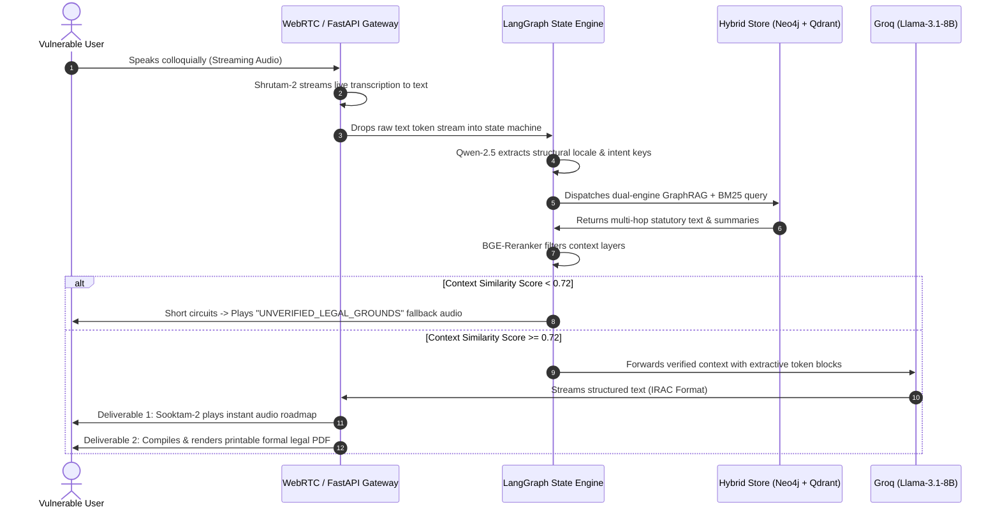

# ⚖️ LegalMind: The Asymmetrical Justice Engine

[](https://www.python.org/)
[](https://langchain-ai.github.io/langgraph/)
[](https://fastapi.tiangolo.com/)
[](https://neo4j.com/)
[](https://qdrant.tech/)

> **LegalMind** is an independent, production-grade AI systems architecture designed to bridge the gap in legal equity for low-literacy and marginalized populations. Operating as an **Asymmetrical Justice Engine**, it converts unstructured, conversational regional voice queries into deterministic, legally grounded audio instructions and verified, printable formal documents. By decoupling Behavioral Audio Orchestration (Voice-to-Voice) from Structural Context Trees (RAPTOR), an Immutable Knowledge Graph (Neo4j), and a cloud-based inference gateway (Groq), LegalMind eliminates legal hallucinations via a token-level Citation Faithfulness Shield.

---

## 🚀 Key Value Proposition & Architecture Overview

Traditional legal frameworks heavily disadvantage illiterate or marginalized individuals who cannot navigate complex statutes or afford representation. **LegalMind** rebalances this symmetry:

- **Colloquial-to-Deterministic Mapping** — Processes raw, emotional regional dialects and maps "colloquial panic" to strict structural legal intents.
- **Absolute Hallucination Shield** — Restricts inference to strict extractive citation constraints, short-circuiting if grounding metrics drop below target thresholds.
- **Sovereign & Private Hosting** — Built to run on lightweight, cost-effective infrastructure (like AWS EC2 Free Tier) by utilizing serverless database clouds (Neo4j AuraDB & Qdrant Cloud) and lightning-fast Groq API integrations.

---

## 🤖 System Execution Layers & State Machine

LegalMind coordinates data orchestration across three specialized execution layers within a stateful, cyclic workflow built on LangGraph:


### Core Layer Responsibilities

| Execution Layer | Component Stack | Core Structural Function |
| --- | --- | --- |
| **🔊 Voice-to-Voice Gateway** | Shrutam-2 + Qwen-2.5 + Sooktam-2 / gTTS | Streams bidirectional regional speech via WebRTC and WhatsApp; maps conversational user panic to localized schema keys (e.g., `incident_type: illegal_eviction`); synthesizes high-fidelity, natural audio roadmaps for illiterate accessibility. |
| **🕸️ The Knowledge Network** | RAPTOR + Neo4j + Qdrant BM25 | Executes multi-hop semantic loops linking recursive summarization trees to an immutable dependency graph (`Statute` $\rightarrow$ `Section` $\rightarrow$ `Case Precedent`) alongside dense/lexical indices. |
| **⚡ The Inference Engine** | Groq Llama-3.1-8B-Instant | High-throughput, cloud-based text serving enforcing strict extractive constraints; applies programmatic token checks to ensure responses strictly adhere to retrieved facts. |

---

## 🛠️ System Architecture & Data Flow

LegalMind ensures low latency (~380ms) and data sovereignty by containerizing database components and running prefix-cached inference pipelines.



---

## 📂 Project Structure

```
.
├── config/                  # Neo4j schema definitions and system variables
├── data/
│   ├── ingestion/           # Playwright background legal portal scrapers
│   ├── processing/          # RAPTOR hierarchical clustering and tokenizers
│   └── synthesis/           # Synthetic dataset pipelines (IRAC format generation)
├── database/
│   ├── graph_store.py       # Neo4j query routing interfaces and Cypher compilers
│   └── vector_store.py      # Qdrant collection setup and hybrid search logic
├── audio/
│   ├── stt_gateway.py       # Shrutam-2 streaming transcription loop
│   └── tts_renderer.py      # Sooktam-2 speech synthesis wrapper
├── app/
│   ├── evaluator.py         # LLM-as-a-Judge evaluation framework
│   ├── pipeline.py          # Master LangGraph state machine with Agentic RAG fallback
│   ├── server.py            # FastAPI backend endpoints & Twilio webhook integration
│   └── whatsapp_session.py  # Hybrid stateful session manager (Redis/JSON file fallback)
├── scripts/
│   ├── run_evaluation.py    # Automated evaluation harness for quality metrics
│   ├── setup_ec2.sh         # Automated environment configuration script for AWS EC2
│   ├── test_cloud_credentials.py # Cloud database & LLM connectivity checker
│   └── ingest_xml_statutes.py # Ingestion pipeline parser for Indian Statutes
├── evaluation_report.md     # Auto-generated quality evaluation results
└── README.md
```

---

## 📦 Production Installation & Configuration (AWS EC2)

To deploy LegalMind on a memory-constrained virtual machine (such as an **AWS EC2 Free Tier `t2.micro`** instance with 1GB RAM):

### 1. Provision Cloud Databases
Instead of hosting local databases which crash under limited memory, provision the following free tiers:
* **Graph Store**: [Neo4j AuraDB Free Tier](https://neo4j.com/cloud/platform/auradb/) (gives you a `neo4j+s://` URI).
* **Vector Store**: [Qdrant Cloud Free Tier](https://qdrant.tech/cloud/) (gives you a HTTPS cluster host and API Key).

### 2. Configure Environment variables
Create a `.env` file in the root directory:
```env
# Database Credentials
NEO4J_URI=neo4j+s://your-neo4j-auradb-endpoint.databases.neo4j.io
NEO4J_USER=neo4j
NEO4J_PASSWORD=your_neo4j_password

QDRANT_API_KEY=your_qdrant_api_key
QDRANT_HOST=https://your-qdrant-cloud-cluster.aws.cloud.qdrant.io

# Model Inference Configuration
GROQ_API_KEY=gsk_your_groq_api_key
GROQ_MODEL=llama-3.1-8b-instant
ENABLE_RERANKER=False # Disables heavy local models to preserve memory

# Twilio WhatsApp Business API configurations
TWILIO_ACCOUNT_SID=AC_your_twilio_sid
TWILIO_AUTH_TOKEN=your_twilio_auth_token
TWILIO_WHATSAPP_NUMBER=whatsapp:+14155238886 # Twilio Sandbox Number
PUBLIC_URL=https://your-custom-subdomain.duckdns.org
```

### 3. Deploy Using setup_ec2.sh
Upload the codebase to the EC2 instance, make the setup script executable, and run it:
```bash
chmod +x scripts/setup_ec2.sh
./scripts/setup_ec2.sh
```
This script automates:
* Creation of a **2GB Swap space** (prevents Out-Of-Memory compilation crashes).
* Installation of system requirements (Python venv, Nginx, Certbot).
* Setup of the background systemd service `legalmind.service`.
* Nginx proxy configurations pointing port 80/443 traffic directly to `uvicorn` on port 8080.

### 4. Validate Credentials
Run the verification check script to ensure all API keys and cloud endpoints resolve correctly:
```bash
python scripts/test_cloud_credentials.py
```

---

## 🧠 Prompt Engineering & RAG Specification

LegalMind enforces structure and tone directly through advanced **In-Context Prompt Engineering** and the **Citation Faithfulness Shield**.

### 1. Extractive Legal Prompts (IRAC Formatting)
The system guides base instruction models (like `Llama-3.1-8B-Instruct` or `Groq` API endpoints) by wrapping retrieved statutory text in strict system instructions. It utilizes structured JSON templates (forcing `ISSUE`, `RULE`, `APPLICATION`, `CONCLUSION`, and `LAYPERSON` structures) to prevent conversational filler and enforce precise legal formatting.

### 2. Malayalam Translation & Phrasing Optimization
To guarantee natural dialect responses, the pipeline avoids hardcoded string replacements. Instead, it utilizes **few-shot prompt examples** within the `SLOT_FILLING` agent block. This guides the generator to output polite and native Malayalam dialog (e.g. *"കുറ്റകൃത്യം/സംഭവം നടന്ന തീയതി പറയാമോ?"* instead of robotic literal translations).

### 3. The Verification Gate
The pipeline implements a programmatic verification step to inspect generated roadmaps. It checks:
- **Statute Grounding**: Ensures the LLM only cites laws retrieved by the GraphRAG and Vector retrieval layers.
- **Zero Hallucination**: Verifies that no fictitious section numbers or placeholder text (like `***`) contaminate the output.
- **Jurisdictional Boundary Guard**: Detects and flags cross-contamination of mismatching state laws.
- **Regional Script Normalization**: Resolves dialect spelling variations (e.g., mapping *"എറണാകുളം"* and *"കൊച്ചി"* to English slots like *"Ernakulam"* and *"Kochi"*) prior to structural analysis to avoid slot-filling loops.

---

## 📊 Quality Auditing & LLM-as-a-Judge

To verify reliability, accuracy, and safety, the project integrates an automated LLM-as-a-Judge evaluation suite (`scripts/run_evaluation.py`). 

The harness executes 12 multi-lingual scenarios (English & Malayalam) across Ragging, Eviction, Wage Theft, Consumer Complaints, Greetings, and Clarifications. Each response is graded dynamically by the LLM-as-a-Judge (`app/evaluator.py`) across five metrics:

- **Faithfulness (Threshold: >= 0.70)**: Verifies that the response relies strictly and exclusively on the retrieved legal context.
- **Relevance (Threshold: >= 0.80)**: Checks if the response directly addresses the user's specific query.
- **Language Compliance (Threshold: >= 0.90)**: Enforces zero language mixing (maintaining strict Malayalam-only or English-only turns).
- **Hallucination Rate (Threshold: <= 0.10)**: Validates that the model does not invent fictitious sections, acts, or rules.
- **Completeness (Threshold: >= 0.80)**: Enforces that generated legal assessments contain the full IRAC block andLayperson instructions.

All metrics are verified locally, outputting a Markdown evaluation summary (`evaluation_report.md`) on completion.

---

## 💬 WhatsApp Integration & Webhook Interface

LegalMind features a stateful, interactive WhatsApp chatbot gateway allowing marginalized users to access legal assessments and printable notice documents easily.

### Webhook Specifications
- **Endpoint**: `POST /whatsapp/webhook` (configured in Twilio Console).
- **Session Management**: Phone-number-based caching in [whatsapp_session.py](file:///Users/vishnup/Desktop/projects/Legalmind/app/whatsapp_session.py). Dynamically tracks locked language preferences (`session["lang"]`) and user modality (`session["modality"]`).
- **Voice Message Processing & TTS**: Incoming audio files are transcribed. If `session["modality"] == "voice"`, the bot synthesizes the layperson roadmap response into high-fidelity speech and plays it back as a voice note attachment on every subsequent turn.
- **Document Delivery**: Notice drafts are compiled into a styled PDF (`data/synthesis/formal_notice.pdf`) and pushed directly into the WhatsApp thread as an attachment using Twilio's Media API.

### 📲 How to Use & Test (Twilio Free Sandbox)
Because the development and trial phases run under a **Twilio Free Trial Sandbox**, users must first register their numbers with the sandbox before they can receive chatbot replies:
1. **Join the Sandbox**: On your personal phone, send a WhatsApp message containing **`join whose-writing`** (or your account's specific sandbox registration phrase) to your Twilio Sandbox number (e.g. **`+1 415 523 8886`**).
2. **Confirmation**: Wait for Twilio to reply confirming that you have successfully joined the sandbox.
3. **Start Conversing**: Send any greeting (e.g., `hi`) or describe a legal incident in English or Malayalam.
4. **Purging Session History**: Send **`/reset`**, **`reset`**, or **`clear`** at any point in the chat to wipe the slot-filling history and start a new dialogue session.

---

## 📈 Future Roadmap

* [x] **Agentic RAG Fallback Loop** — Loop RAG checks to scrape and ingest Wikipedia/Web statutes dynamically if offline queries fail shield checks.
* [x] **Stateful WhatsApp Gateway** — Webhook integrations with automatic audio transcription and PDF attachments.
* [x] **Bidirectional Voice-to-Voice Modality** — Lock conversation modality to voice, serving TTS audio roadmaps dynamically on all turns.
* [x] **LLM-as-a-Judge Evaluation Suite** — Quality metric auditing for Faithfulness, Relevance, Language Compliance, Hallucination, and Completeness.
* [ ] **Dynamic Cross-Lingual Code-Switching** — Upgrade STT pipelines to handle mixed Manglish (Malayalam + English) input smoothly.
* [ ] **Hardware-Accelerated Edge Voice Deployments** — Package the transcription and intent-extraction engines into standalone edge hardware devices.

---

## 📜 License

Licensed under the [MIT License](https://www.google.com/search?q=LICENSE). Created by **Vishnu P**.

